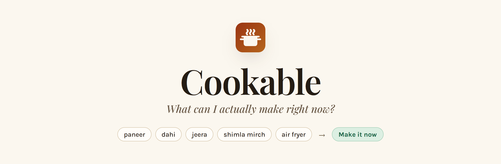
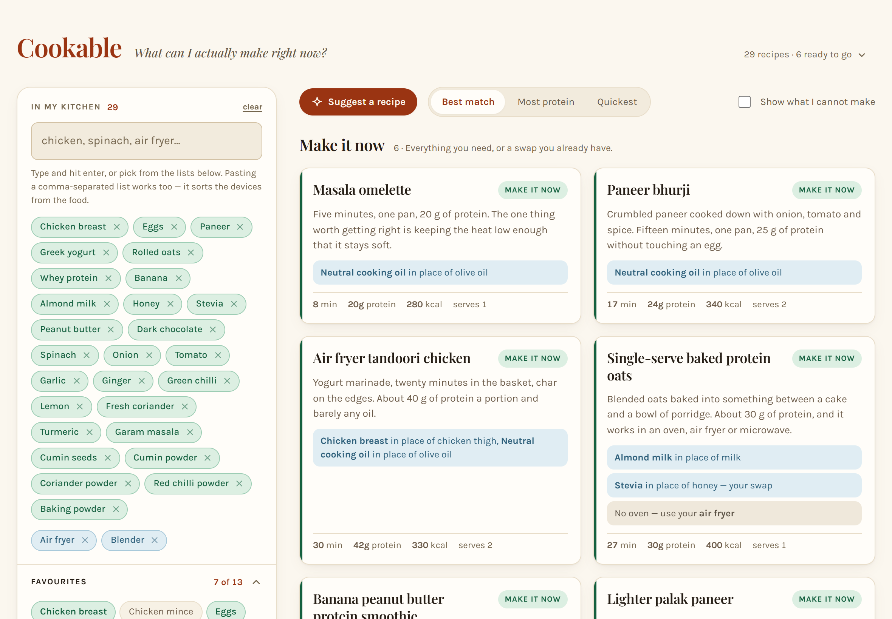
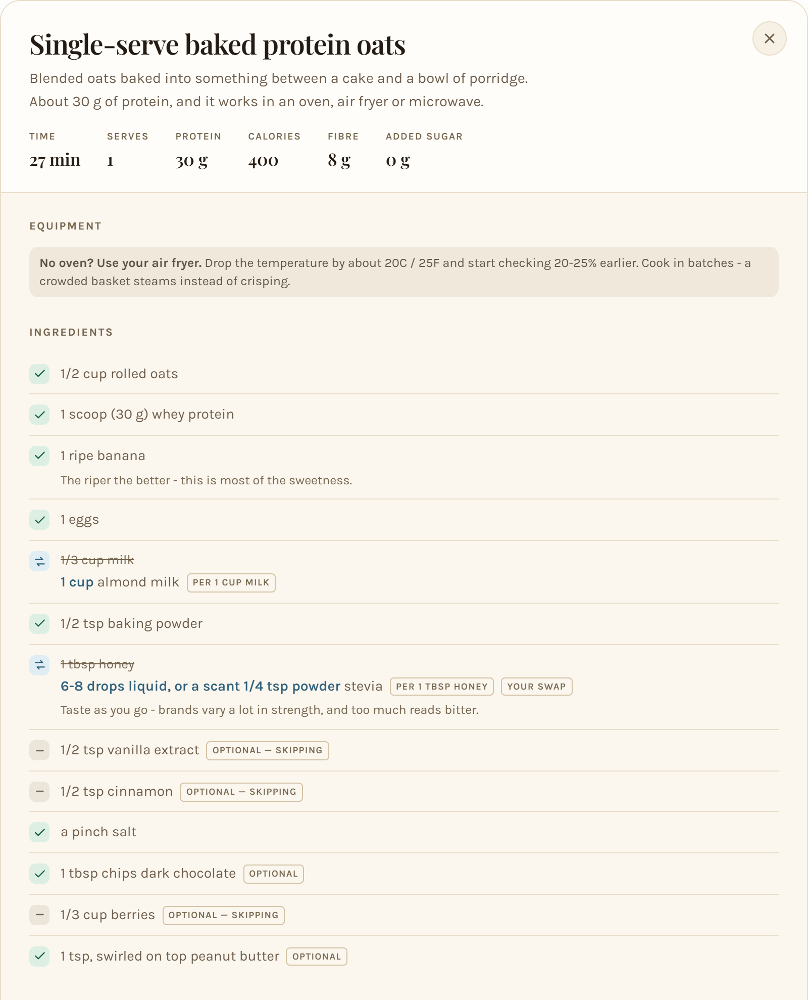
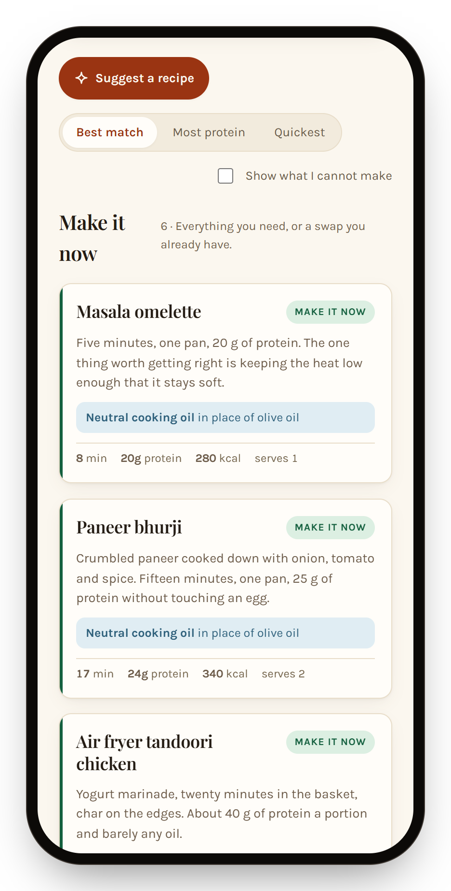
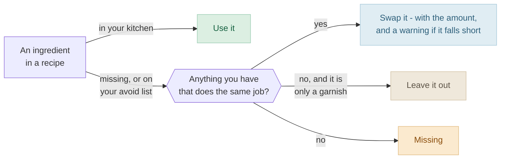

<!-- Every picture in this file is taken from the running app by `npm run readme-images`. Rerun it after a UI change rather than editing the PNGs. -->

<picture>
  <source media="(prefers-color-scheme: dark)" srcset="docs/images/banner-dark.png">
  
</picture>

<p align="center">
  <b>Tell it what is in your kitchen. It tells you what you can cook tonight,<br>
  and works out the swaps for whatever you are missing.</b>
</p>

<p align="center">
  <a href="https://cookable-ssd.vercel.app/"></a>
</p>

<p align="center">
  
  
  
  
  
</p>

<p align="center">
  <a href="#how-to-use-it">How to use it</a> &nbsp;·&nbsp;
  <a href="#make-it-your-own">Make it your own</a> &nbsp;·&nbsp;
  <a href="#how-it-was-vibe-coded">How it was vibe coded</a> &nbsp;·&nbsp;
  <a href="#how-it-decides">How it decides</a>
</p>

> [!NOTE]
> **Cookable is vibe coded.** The matching engine, the interface, the recipe database and this README were all built by describing what was wanted to [Claude Code](https://claude.com/claude-code), one pull request at a time - from an empty repository to an installable app in six days. [How that worked](#how-it-was-vibe-coded)

<picture>
  <source media="(prefers-color-scheme: dark)" srcset="docs/images/kitchen-dark.png">
  
</picture>

Most recipe apps start from a recipe and send you to the shops. Cookable starts from what you already have. It reads your kitchen the way you would say it, checks every recipe line by line, and when something is missing it looks for what you could use instead - with the amount, and a warning when the stand-in cannot do the whole job.

<table>
  <tr>
    <td width="50%" valign="top">
      <b>Speaks your kitchen</b><br>
      <code>dahi</code>, <code>jeera</code>, <code>atta</code>, <code>shimla mirch</code>, <code>kadai</code>, <code>mixie</code>, <code>2 large onions</code>. Paste a whole list and it sorts the food from the devices.
    </td>
    <td width="50%" valign="top">
      <b>Swaps come with amounts</b><br>
      No honey? 6-8 drops of liquid stevia per tablespoon - and what to add back if the honey was what held things together.
    </td>
  </tr>
  <tr>
    <td valign="top">
      <b>Knows what the dish is</b><br>
      It will happily swap the oil in paneer bhurji. It will never swap the paneer.
    </td>
    <td valign="top">
      <b>Plans around your devices</b><br>
      No oven? Use the air fryer about 20°C cooler and check it 20-25% sooner. No pressure cooker? A covered pan and three times as long.
    </td>
  </tr>
  <tr>
    <td valign="top">
      <b>Healthy by default</b><br>
      Protein, calories, fibre and added sugar on every recipe. Sugar, honey and jaggery are swapped out whenever there is a way.
    </td>
    <td valign="top">
      <b>Lives on your phone</b><br>
      Installs like an app and opens with no signal. No account and no server: your kitchen stays in your browser.
    </td>
  </tr>
</table>

## How to use it

Open **[cookable-ssd.vercel.app](https://cookable-ssd.vercel.app/)**. There is nothing to sign up for.

### 1. Tell it what you have

Type into **In my kitchen** and press <kbd>Enter</kbd>, or paste a whole list at once - `chicken, palak, dahi, air fryer, mixie`. Would rather tap? Open **Favourites**, **Equipment**, **Key ingredients**, **Spices & herbs** or **Sweeteners** and tick things off.

Leave **I have the basics** switched on, and salt, pepper, water, cooking oil, a stove, a pan and a fridge are taken as read.

### 2. Read the shelves

Every recipe lands on one of four shelves, and every card says what it is swapping and what you are missing.

| Shelf | What it means |
| --- | --- |
| **Make it now** | You have everything, or a swap you already own covers it |
| **One or two things short** | One or two ingredients with nothing to stand in - none the dish depends on |
| **A few things short** | Three or more of those |
| **Not without a shop** | Something it cannot work without is missing, with no stand-in. Hidden until you tick **Show what I cannot make** |

Sort any of them by **Best match**, **Most protein** or **Quickest**.

### 3. Open a recipe

The ingredient list is rewritten for your kitchen. What you do not have is struck out with the stand-in and its amount underneath, a missing device comes with the adjustment for the one you do have, and anything still missing becomes a shopping list.

<p align="center">
  <picture>
    <source media="(prefers-color-scheme: dark)" srcset="docs/images/recipe-dark.png">
    
  </picture>
</p>

### 4. Or let it choose

**Suggest a recipe** works even with an empty kitchen. It leans towards recipes that use what you have picked, never offers one that needs something on your avoid list, and draws from a shuffle bag - so it does not hand back the recipe you just turned down.

The recipe counter at the top opens the whole collection, A to Z.

### 5. Put it on your phone

<table>
  <tr>
    <td width="300" align="center">
      <picture>
        <source media="(prefers-color-scheme: dark)" srcset="docs/images/phone-dark.png">
        
      </picture>
    </td>
    <td valign="middle">
      <b>Android</b> - open it in Chrome, then <b>⋮</b> → <b>Add to Home screen</b> (or <b>Install app</b>).<br><br>
      <b>iPhone</b> - open it in Safari, then <b>Share</b> → <b>Add to Home Screen</b>.<br><br>
      <b>Laptop</b> - click the install icon at the right of the address bar in Chrome or Edge.<br><br>
      It opens full screen like any other app, and after the first visit it works with no signal at all.
    </td>
  </tr>
</table>

## Make it your own

Cookable is a personal app. The recipes, the favourites, the list of things to swap out and the recipes marked as rarely cooked all belong to one kitchen. You can have a copy that fits yours without writing code or touching the JSON by hand - [Claude Code](https://claude.com/claude-code) does the editing.

### 1. Get your own copy

[](https://vercel.com/new/clone?repository-url=https%3A%2F%2Fgithub.com%2Fsartaj1995%2Fcookable&project-name=cookable&repository-name=cookable)

That copies the repository into your GitHub account and puts it online. Every push after that redeploys it.

Or run it on your own machine (Node 22 or newer):

```bash
git clone https://github.com/<your-username>/cookable.git
cd cookable
npm install
npm run dev
```

It opens at http://localhost:5180.

### 2. Open it in Claude Code

Start Claude Code in the `cookable` folder. [`CLAUDE.md`](CLAUDE.md) is the project's memory: it tells Claude Code how a recipe file is shaped, what the matching flags mean and how the house style reads, so you only have to say what you want.

### 3. Add your recipes

```text
/add-recipe https://youtube.com/shorts/...
/add-recipe <paste a transcript, or a recipe from anywhere>
```

[`/add-recipe`](.claude/commands/add-recipe.md) pulls out the ingredients and method, keeps vague quantities vague rather than inventing numbers, makes the recipe healthier and writes down every change, maps each ingredient to the registry (adding new ones under the names people actually type, Hindi included), sets the matching flags, estimates nutrition, validates the result - and then tells you which numbers it had to guess.

> [!TIP]
> Paste the transcript when you can. A bare YouTube link usually brings back the title and description but not what was said, and `/add-recipe` will ask for more rather than make up a recipe from a title.

### 4. Tell it about yourself

There is no settings screen. Preferences live in files, and you change them by saying so:

| Say to Claude Code | What changes |
| --- | --- |
| "I'm vegetarian" | A diet flag in `data/preferences.json`. Meat gets swapped where it can be before a recipe is ruled out |
| "I'm allergic to peanuts" | `avoid` - a hard no. Never suggested, never used |
| "I'd rather not have sugar" | `prefer_not` - swapped out whenever there is a way, but it never blocks a recipe |
| "When there's a choice, use monk fruit first" | `prefer` - the order stand-ins are offered in |
| "Put eggs and paneer at the top of the list" | `data/favourites.json` |
| "I'll rarely make rajma" | `rare` in `data/standing.json` - sorted last, and left out of Suggest |
| "Allulose works in place of sugar" | A new swap, via [`/add-swap`](.claude/commands/add-swap.md) |

### 5. Check it and ship it

```bash
npm run validate
git push
```

`validate` catches the mistake that matters most: a recipe naming an ingredient id that does not exist looks perfectly fine in the app and can never be matched. On a Vercel copy, the push is the deploy.

<details>
<summary><b>Where everything lives</b></summary>

| Path | What it is |
| --- | --- |
| `recipes/*.json` | One file per recipe. Add a file and the app picks it up - there is no index |
| `data/ingredients.json` | Ingredient ids, with the names people actually type |
| `data/substitutions.json` | The swap table: groups that stand in for each other, and one-way rules |
| `data/equipment.json` | Devices, and what to use when you do not have one |
| `data/preferences.json` | The avoid list, the swap-out list, preferred stand-ins and diet flags |
| `data/favourites.json` | The shortlist pinned to the top of the kitchen panel |
| `data/standing.json` | The recipes you cook all the time, and the ones you rarely make |
| `src/lib/match.ts` | The matching engine |
| `src/lib/suggest.ts` | Suggest a recipe |
| `src/lib/normalize.ts` | Turns what you type into ingredient and device ids |
| `scripts/validate.mjs` | The data checks |
| `public/sw.js` | The service worker that lets the app open offline |
| [`SCHEMA.md`](SCHEMA.md) | Every field in every file |
| [`CLAUDE.md`](CLAUDE.md) | The conventions Claude Code works to |

</details>

<details>
<summary><b>Scripts</b></summary>

| Command | What it does |
| --- | --- |
| `npm run dev` | Runs the app at http://localhost:5180 |
| `npm run build` | Type-checks and builds into `dist/` |
| `npm run preview` | Serves that build |
| `npm run validate` | Checks the data. Run it after every change |
| `npm run icons` | Redraws the app icons |
| `npm run readme-images` | Retakes the pictures in this README from the app, in light and dark. Needs Chrome or Edge |

</details>

## How it was vibe coded

<!-- TODO(human): 2-4 sentences in your own voice - why you wanted this app, and what building it by conversation was actually like. Everything else in this README can be read off the repo; this part cannot. -->

Cookable's first commit went in on 7 September 2026. By 12 September it had 21 merged pull requests, 29 recipes, 174 ingredients, 23 swap groups, 16 one-way swap rules and around 4,000 lines of code, and it installed on a phone like any other app.

What kept it coherent - and what is worth borrowing if you want to build something like it:

1. **A `CLAUDE.md` that explains why, not just what.** "If the ingredient is in the title, it is `sub_group: "none"`" is a rule a fresh session can apply without being told twice. Every convention in [`CLAUDE.md`](CLAUDE.md) carries its reason.
2. **Slash commands for the jobs that repeat.** [`/add-recipe`](.claude/commands/add-recipe.md) is a checklist in plain English, and it names the one thing not to do: pass off a recipe invented from a video's title as the video's own.
3. **A validator as the safety net.** The worst mistakes in a data-driven app are the silent ones. `npm run validate` turns them into errors.
4. **Plain JSON in git.** No database and no admin screen. Every recipe is a file, and every change is a diff you can read.
5. **One pull request per change.** Small enough to review, easy to undo.
6. **Decisions written down next to the code.** The comments in [`src/lib/suggest.ts`](src/lib/suggest.ts) explain why Suggest is a shuffle bag rather than a dice roll, so the reasoning from one conversation is there for the next.

Starting your own? Write one sentence about what the app is for, let Claude Code build a first version, and whenever you catch yourself making the same correction twice, put it in `CLAUDE.md`. This repository's [`CLAUDE.md`](CLAUDE.md) and [`.claude/commands`](.claude/commands) are a working example to borrow from.

## How it decides

Every ingredient line in every recipe goes through the same question:



Then the recipe is shelved by whatever is still missing. A missing must-have, or a device with no stand-in, puts it on **Not without a shop**. Otherwise nothing missing is **Make it now**, one or two is **One or two things short**, and three or more is **A few things short**.

### Three flags do most of the work

Any ingredient line in a recipe can carry one of them:

| Flag | Means | When you do not have it |
| --- | --- | --- |
| `core: true` | The recipe does not work without it | Blocked, unless a like-for-like swap is in your kitchen |
| <code>sub_group:&nbsp;"none"</code> | The dish *is* this ingredient - paneer in paneer bhurji | Never swapped, not even for a close match |
| `optional: true` | A garnish or a nice-to-have | Left out, never swapped |
| no flag | Needed, but a stand-in will do | Swapped if anything fits; otherwise the recipe drops a shelf |

### The swap table knows what an ingredient is for

Each recipe line says what the ingredient is doing there, and each stand-in in [`data/substitutions.json`](data/substitutions.json) says what it can and cannot do:

```jsonc
// The honey line in baked protein oats
{ "id": "honey", "qty": "1 tbsp", "function": "sweetness" }

// Stevia, in the sweeteners group - where every amount is per 1 tbsp honey
{
  "ingredient": "stevia",
  "amount": "6-8 drops liquid, or a scant 1/4 tsp powder",
  "provides": ["sweetness"],
  "lacks": ["bulk", "binding", "browning", "moisture"],
  "compensate": "Replace the missing volume: for each tbsp of syrup swapped out, add ~1 tbsp of the recipe's own liquid (milk/water) for batters, or ~1 tbsp extra nut butter / date paste where the syrup was holding things together."
}
```

The honey here is only there to sweeten, so stevia is a clean swap. Had the line said `"function": "binding"`, stevia would still be offered, but with its `compensate` note as a warning - and never for a `core` ingredient. A stand-in that lacks something and has no `compensate` note is never offered at all: Cookable will not suggest a swap it cannot explain.

### Ordering

Shelf first, always. Within a shelf, the recipes you cook all the time come first and the ones you rarely make come last ([`data/standing.json`](data/standing.json)); after that the better fit wins - fewer things missing, fewer imperfect swaps, less time. How much you like a dish never lifts it onto a better shelf: a favourite you cannot cook tonight will not outrank something you can.

## Credits

Recipes taken from videos link back to them in the app, and every change made to them is written down in the recipe's `source.adapted`. Thanks to **Ralston D'Souza**, **Panacea Palm**, **Stefan Bodegrajac** and **Jonathan Clarke**, whose recipes are in here.

Built with React 18, TypeScript and Vite, and set in Playfair Display and Karla.

<p align="center">
  <sub>Made by <a href="https://github.com/sartaj1995">Sartaj Singh Dhatt</a> with <a href="https://claude.com/claude-code">Claude Code</a>.</sub>
</p>
